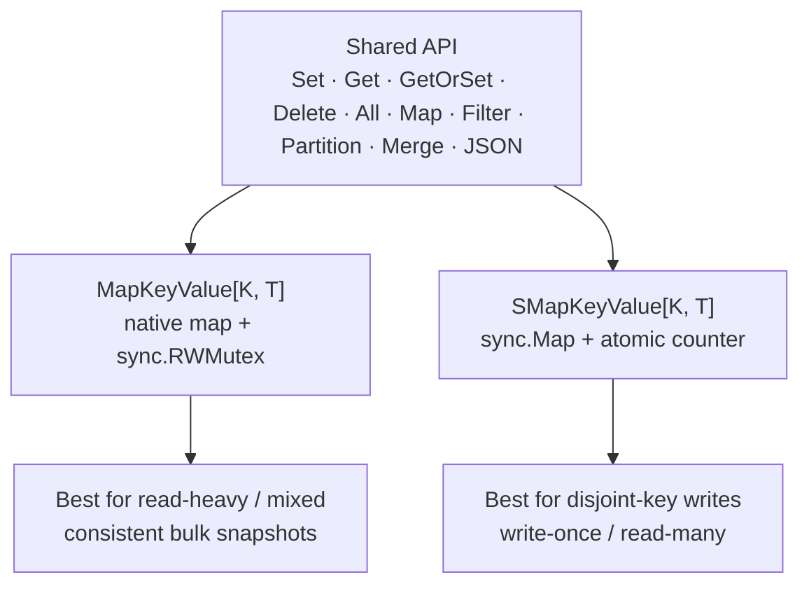

# 🧠 RamStorage (r9e)

[](https://github.com/slashdevops/r9e/actions/workflows/main.yml)

[](https://pkg.go.dev/github.com/slashdevops/r9e)
[](https://goreportcard.com/report/github.com/slashdevops/r9e)
[](https://github.com/slashdevops/r9e/actions/workflows/codeql.yml)
[](https://github.com/slashdevops/r9e/blob/main/LICENSE)
[](https://github.com/slashdevops/r9e/actions/workflows/release.yml)
[](https://github.com/slashdevops/r9e/releases)

**RamStorage (`r9e`)** is a small, **thread-safe**, **generic**, dependency-free
[Go](https://go.dev/) library of in-memory key-value containers with a rich set
of convenient methods to store, retrieve, transform, and iterate data.

It is focused on **usability and simplicity** — without giving up performance.
Only the Go standard library is used; there are **zero third-party
dependencies**.

## ✨ Features

- 🔒 **Thread-safe** — every operation is safe for concurrent use.
- 🧬 **Generic** — `MapKeyValue[K comparable, T any]` stores any comparable key
  and any value type.
- 🧱 **Two containers, one API** — a `sync.RWMutex`-backed map and a `sync.Map`-backed
  store expose the same method set, so you can switch by workload.
- 🔁 **Range-over-func iterators** — `for k, v := range kv.All()` (Go 1.23+).
- 🧰 **Functional helpers** — `Map`, `Filter`, `Partition`, `Merge`, `Clone`,
  `GetOrSet`, `SortKeys`, `SortValues` — all non-mutating where it matters.
- 🗄️ **JSON-ready** — implements `json.Marshaler` / `json.Unmarshaler`.
- ⚡ **O(1) `Size()`** on both containers.
- 🚫 **Zero dependencies** — standard library only.
- 📄 **Apache-2.0 licensed**.

## 🧭 Overview

`r9e` takes advantage of [Go generics](https://go.dev/blog/intro-generics) and
the standard library's own concurrency primitives to provide a simple way to
store and retrieve data from memory. Two containers share the **same method
set**:



### Available Containers

| Container | Backing | Best for |
| --------- | ------- | -------- |
| [`MapKeyValue[K, T]`](https://pkg.go.dev/github.com/slashdevops/r9e#MapKeyValue) | `map` + [`sync.RWMutex`](https://pkg.go.dev/sync#RWMutex) | Read-heavy / mixed workloads, consistent snapshots |
| [`SMapKeyValue[K, T]`](https://pkg.go.dev/github.com/slashdevops/r9e#SMapKeyValue) | [`sync.Map`](https://pkg.go.dev/sync#Map) + atomic counter | Disjoint-key writes, write-once/read-many |

> **Not sure which to use?** Start with `MapKeyValue`. Switch to `SMapKeyValue`
> only if profiling shows the `sync.Map` access pattern fits your workload
> better. See [docs/containers.md](docs/containers.md).

## 📋 Requirements

- **Go 1.26 or newer**
- No external Go modules

## 📦 Installation

Add the latest release to your module:

```bash
go get github.com/slashdevops/r9e@latest
```

Pin a specific version:

```bash
go get github.com/slashdevops/r9e@vX.Y.Z
```

Update to the newest available version later:

```bash
go get -u github.com/slashdevops/r9e
```

Then import it:

```go
import "github.com/slashdevops/r9e"
```

## 🚀 Quick Start

```go
package main

import (
    "fmt"

    "github.com/slashdevops/r9e"
)

func main() {
    kv := r9e.NewMapKeyValue[string, int]()

    kv.Set("answer", 42)

    if v, ok := kv.GetAndCheck("answer"); ok {
        fmt.Println("answer =", v) // answer = 42
    }

    // Range-over-func iteration (Go 1.23+).
    for k, v := range kv.All() {
        fmt.Printf("%s = %d\n", k, v)
    }
}
```

### A richer example

```go
type Constant struct {
    Name  string
    Value float64
}

kv := r9e.NewMapKeyValue[string, Constant](r9e.WithCapacity(8))

kv.Set("pi", Constant{"Archimedes' constant", 3.141592})
kv.Set("e", Constant{"Euler's number", 2.718281})
kv.Set("phi", Constant{"Golden ratio", 1.618033})

// Keep only the "large" constants (returns a NEW container).
large := kv.FilterValue(func(c Constant) bool { return c.Value > 2.0 })

// Sort the survivors by value.
sorted := large.SortValues(func(a, b Constant) bool { return a.Value > b.Value })
for _, c := range sorted {
    fmt.Printf("%s = %v\n", c.Name, c.Value)
}
```

## 🧩 API at a glance

Both containers implement the same methods:

| Group | Methods |
| ----- | ------- |
| Access | `Set`, `Get`, `GetAndCheck`, `GetOrSet`, `GetAndDelete`, `Delete`, `Clear` |
| Query | `Size`, `IsEmpty`, `ContainsKey`, `ContainsValue` |
| Bulk | `Keys`, `Values`, `All` (iterator), `ForEach`, `ForEachKey`, `ForEachValue` |
| Copy/Combine | `Clone`, `CloneAndClear`, `Merge`, `DeepEqual` |
| Transform | `Map`, `MapKey`, `MapValue`, `Filter`, `FilterKey`, `FilterValue` |
| Split | `Partition`, `PartitionKey`, `PartitionValue` |
| Sort | `SortKeys`, `SortValues` |
| Serialize | `MarshalJSON`, `UnmarshalJSON` |

Full reference: [pkg.go.dev/github.com/slashdevops/r9e](https://pkg.go.dev/github.com/slashdevops/r9e)

## 📚 Documentation

Extensive guides with runnable examples and diagrams live in [`docs/`](docs/):

| Guide | What it covers |
| ----- | -------------- |
| [Getting Started](docs/getting-started.md) | Install, first program, core types. |
| [Containers](docs/containers.md) | `MapKeyValue` vs `SMapKeyValue`, and how to choose. |
| [Concurrency](docs/concurrency.md) | Thread-safety model and locking rules. |
| [Operations](docs/operations.md) | Map / Filter / Partition / Merge / Clone / sorting. |
| [Iteration](docs/iteration.md) | `All()` iterators and the `ForEach` family. |
| [JSON](docs/json.md) | Marshaling containers to and from JSON. |
| [Performance](docs/performance.md) | Cost model, benchmarks, and tuning. |
| [Migration](docs/migration.md) | **What's New in v1.0.0** and breaking changes. |
| [FAQ](docs/faq.md) | Common questions and gotchas. |

Runnable examples also live in [`example_test.go`](example_test.go).

## 🆕 What's New in v1.0.0

`v1.0.0` is the first stable release. It modernizes the library for **Go 1.26**
and adds several long-requested capabilities.

- 🔁 **Range-over-func iterators** — `All()` returns an `iter.Seq2[K, T]`.
- 🧰 **`GetOrSet`** — atomic get-or-insert.
- 🔗 **`Merge`** — combine one container into another.
- 🗄️ **JSON support** — `MarshalJSON` / `UnmarshalJSON` on both containers.
- 🐞 **Correctness fixes**:
  - Fixed potential **deadlocks** in `MapKeyValue` caused by recursive read
    locking in `Clone`, `Map`, `Filter`, `Partition`, `DeepEqual`, and sorting.
  - Fixed `SMapKeyValue.Size()` **over-counting** when overwriting existing keys.
  - Fixed a **non-atomic** counter update race in `SMapKeyValue`.
- 🧹 **Modern internals** — uses `maps`, `slices`, the `clear` builtin, and
  `sync.Map.Clear`.

### 💥 Breaking Changes

| Before | After | Why |
| ------ | ----- | --- |
| `go 1.19` | `go 1.26` | Iterators, `maps`/`slices`, `clear`, `sync.Map.Clear`. |
| `GetAnDelete(...)` | `GetAndDelete(...)` | Fixes a spelling typo in the public API. |
| `IsFull() bool` | *removed* — use `!IsEmpty()` | The old method meant "not empty", which was misleading. |
| `Key(k) K` | *removed* — use `ContainsKey(k)` | The old method returned the key or a zero value; `ContainsKey` is clearer. |
| `SortKeys(...) []*K` | `SortKeys(...) []K` | Returning pointers into internal state was unsafe and unidiomatic. |
| `SortValues(...) []*T` | `SortValues(...) []T` | Same as above. |

Migration guide with before/after snippets: [docs/migration.md](docs/migration.md).

## ⚡ Performance

`r9e` keeps the common operations cheap:

- `Set`, `Get`, `GetAndCheck`, `GetOrSet`, `Delete`, `Size` are **O(1)**.
- `ContainsValue` and the bulk `Map` / `Filter` / `Partition` / sort operations
  are **O(n)**.
- `WithCapacity(n)` presizes `MapKeyValue` to avoid incremental map growth.

Run the benchmarks yourself:

```bash
git clone git@github.com:slashdevops/r9e.git
cd r9e/
make bench
# or:
go test -run '^$' -bench . -benchmem ./...
```

See [docs/performance.md](docs/performance.md) for the cost model and tuning tips.

## ✅ Local Quality Gate

The same checks CI runs:

```bash
make check      # fmt + vet + race tests + build
# individually:
go fmt ./...
go vet ./...
go test -race -covermode=atomic -coverprofile=coverage.txt ./...
go build ./...
```

## 🤝 Contributing

Issues and pull requests are welcome at
[github.com/slashdevops/r9e](https://github.com/slashdevops/r9e). Please keep
changes small, idiomatic, tested, documented, and dependency-free unless there
is a clear reason to expand the project scope. See
[.github/copilot-instructions.md](.github/copilot-instructions.md) (also linked
as `AGENTS.md`) for conventions.

## 📄 License

`RamStorage (r9e)` is released under the [Apache License 2.0](LICENSE):

- <http://www.apache.org/licenses/LICENSE-2.0.html>
