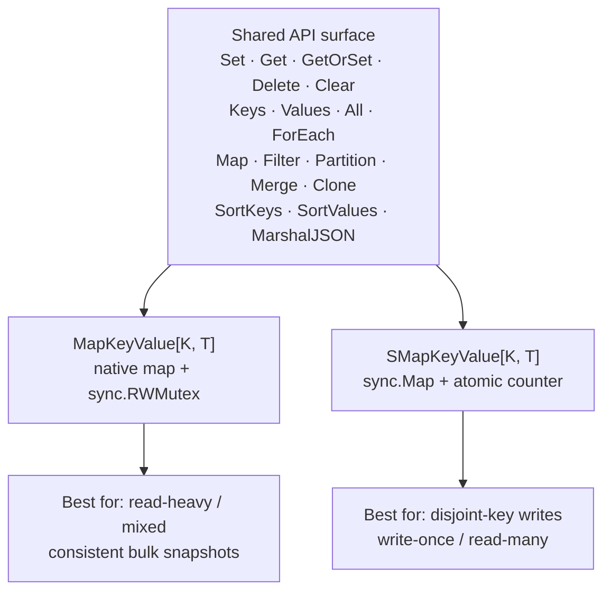

# 📚 r9e Documentation

Welcome to the full documentation for **`r9e`** (*RamStorage*) — a thread-safe,
generic, dependency-free in-memory key-value library for Go.

Everything here is built on the Go standard library only (`sync`,
`sync/atomic`, `iter`, `maps`, `slices`, `reflect`, `encoding/json`). r9e
requires **Go 1.26 or newer**. If you are just getting started, read the guides
in order; otherwise jump straight to the topic you need.

## 🗂️ Table of Contents

| Guide | What it covers |
| ----- | -------------- |
| [Getting Started](getting-started.md) | Installation, your first program, the core types, and `WithCapacity`. |
| [Containers](containers.md) | `MapKeyValue` vs `SMapKeyValue`, their internals, and a decision tree. |
| [Concurrency](concurrency.md) | The thread-safety model, read vs write locks, and the iteration deadlock rule. |
| [Operations](operations.md) | Functional helpers: Map, Filter, Partition, Merge, Clone, GetOrSet, sorting. |
| [Iteration](iteration.md) | `All()` range-over-func, the ForEach family, and deterministic ordering. |
| [JSON](json.md) | `MarshalJSON`/`UnmarshalJSON`, struct fields, and key-type constraints. |
| [Performance](performance.md) | Cost model, presizing, container trade-offs, and running benchmarks. |
| [Migration](migration.md) | What's new in v1.0.0 and how to move off older releases. |
| [FAQ](faq.md) | Common questions, gotchas, and thread-safety of returned values. |

## ⚡ Quick Links

- Package reference: [pkg.go.dev/github.com/slashdevops/r9e](https://pkg.go.dev/github.com/slashdevops/r9e)
- Runnable examples: [`example_test.go`](../example_test.go)
- Source: [`mapkeyvalue.go`](../mapkeyvalue.go), [`smapkeyvalue.go`](../smapkeyvalue.go)

## 🧭 Mental Model

r9e ships **two containers that expose the exact same method set**. You write
your code against one API and pick the backing implementation that fits your
workload — no other code changes.

Both containers are:

- **Generic** — `MapKeyValue[K comparable, T any]` and
  `SMapKeyValue[K comparable, T any]`.
- **Thread-safe** — safe for concurrent use from many goroutines with no
  external locking.
- **Dependency-free** — standard library only.

When in doubt, start with [`MapKeyValue`](containers.md) and
[benchmark both](performance.md) with your own key and value types.

## ➡️ Next

Start with [Getting Started](getting-started.md).
