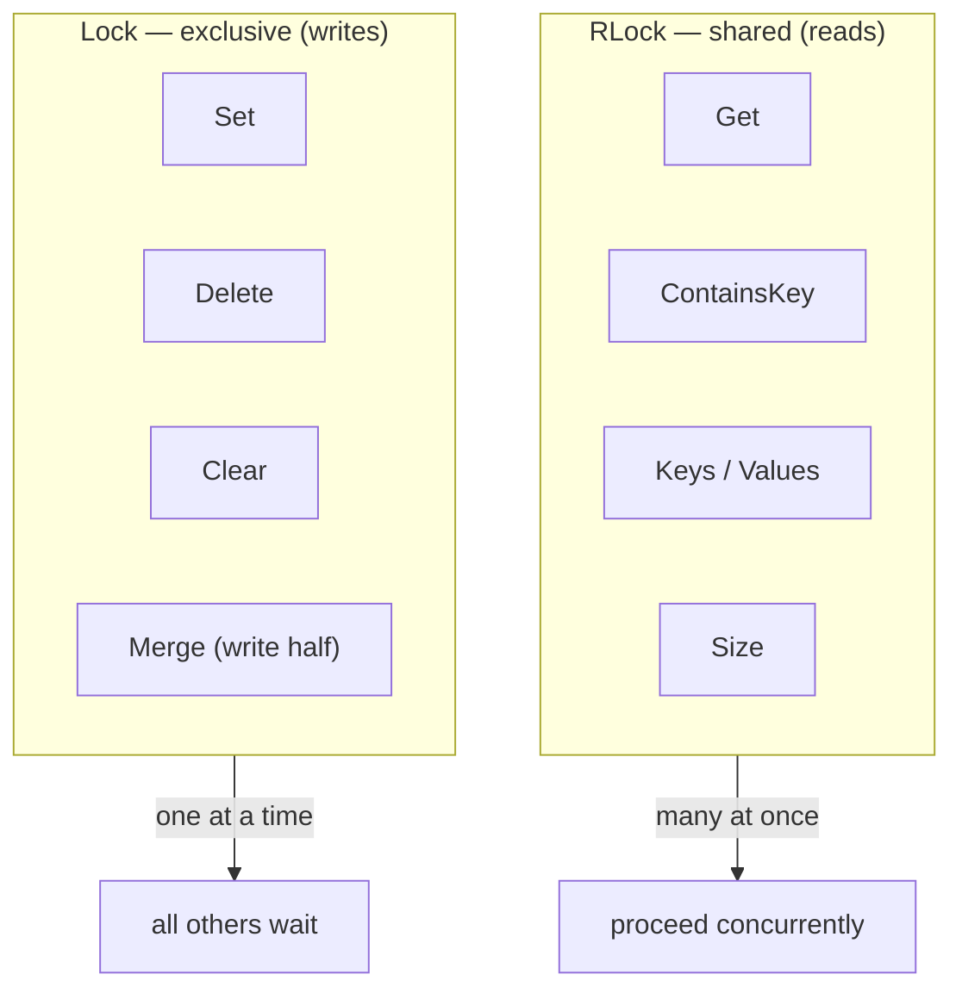
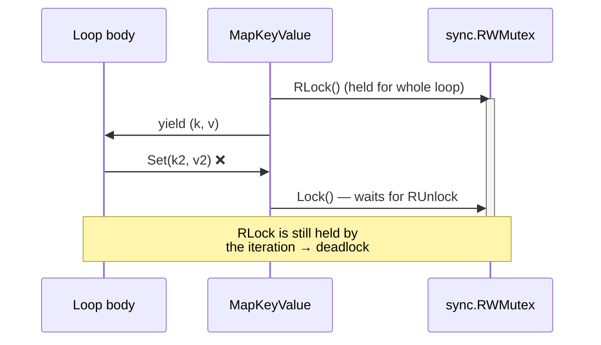
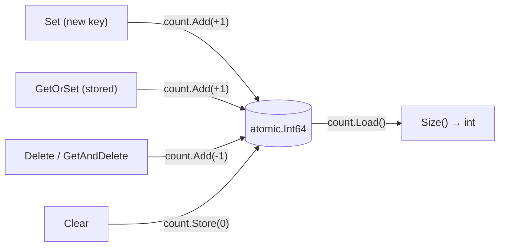

# 🔒 Concurrency

Both containers are safe for concurrent use by multiple goroutines with **no
external locking**. This guide explains the model, the one rule you must not
break, and the O(1) size counter.

## 🧵 Thread-safety model

| Container | Mechanism |
| --------- | --------- |
| `MapKeyValue` | A single `sync.RWMutex` guards the map. Reads take `RLock` (shared); writes take `Lock` (exclusive). |
| `SMapKeyValue` | A `sync.Map` handles concurrency internally; an `atomic.Int64` tracks size. No external lock is ever held. |

You never call `Lock`/`RLock` yourself — every method acquires whatever it
needs and releases it before returning.

## 🔁 Shared reads vs exclusive writes (`MapKeyValue`)

`sync.RWMutex` lets any number of readers proceed together, but a writer must
wait for all readers to finish and then holds the lock alone.



Read methods (`Get`, `GetAndCheck`, `ContainsKey`, `ContainsValue`, `Size`,
`Keys`, `Values`, `All`, `ForEach*`, `DeepEqual`, the `Map`/`Filter`/`Partition`
family, `MarshalJSON`) use the read lock. Write methods (`Set`, `GetOrSet`,
`GetAndDelete`, `Delete`, `Clear`, `Merge`, `CloneAndClear`, `UnmarshalJSON`)
take the exclusive lock.

## ⛔ The iteration rule: do not mutate during `All`/`ForEach`

For **`MapKeyValue`**, `All()` and the `ForEach*` methods hold the **read lock
for the entire duration of the loop**. If the loop body calls a mutating method
on the *same* container, that method blocks forever trying to acquire the
exclusive lock, which the iteration will not release until the body returns —
a classic self-deadlock.



**Rule:** inside `All`/`ForEach*` on a `MapKeyValue`, never call `Set`,
`Delete`, `Clear`, `Merge`, `GetOrSet`, `GetAndDelete`, `CloneAndClear`, or
`UnmarshalJSON` on the container being iterated.

### Safe patterns instead

Collect the changes first, then apply them after the loop ends:

```go
// Collect keys to delete during iteration, delete after.
var stale []string
for k, v := range kv.All() {
    if v.Expired() {
        stale = append(stale, k)
    }
}
for _, k := range stale {
    kv.Delete(k) // loop is over → read lock released
}
```

Or build a new container with a non-mutating helper, which returns a fresh,
independent instance:

```go
fresh := kv.FilterValue(func(v Session) bool { return !v.Expired() })
```

### `SMapKeyValue` iteration is different

`SMapKeyValue.All`/`ForEach*` delegate to `sync.Map.Range`, which holds **no
lock across the callback**. Mutating during iteration does not deadlock, but
the iteration reflects a **moment-in-time view**: concurrent writes may or may
not be visited, per `sync.Map.Range` semantics. Do not rely on seeing (or not
seeing) entries written during the scan.

## 🔢 The atomic size counter

`SMapKeyValue.Size()` is O(1) because `sync.Map` itself has no length. r9e keeps
an `atomic.Int64` that is adjusted on every mutation:



Overwrites are counted correctly: `Set` only increments when the key was newly
inserted, so setting an existing key leaves `Size()` unchanged.

## 🧱 Consistency of returned values

- `Keys()`, `Values()`, `SortKeys`, `SortValues` return **fresh slices** you
  own — mutating them never affects the container.
- `Clone`, `CloneAndClear`, and the `Map`/`Filter`/`Partition` family return
  **new independent containers**.
- Copies are **shallow**: if `T` is a pointer or contains reference types,
  copies share the pointed-to data. See the [FAQ](faq.md) for details.

## ➡️ Next

- Put the shared API to work in [Operations](operations.md).
- Iterate safely in [Iteration](iteration.md).
