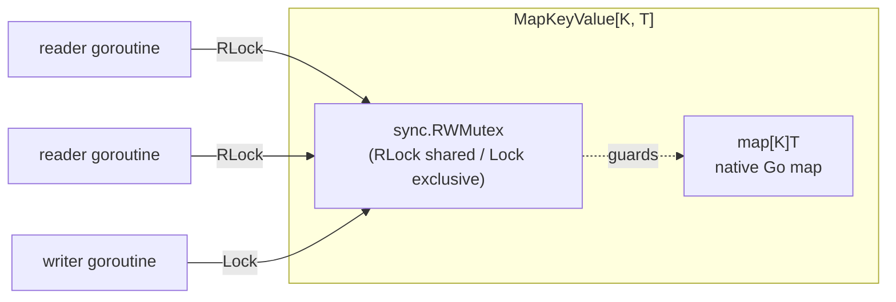
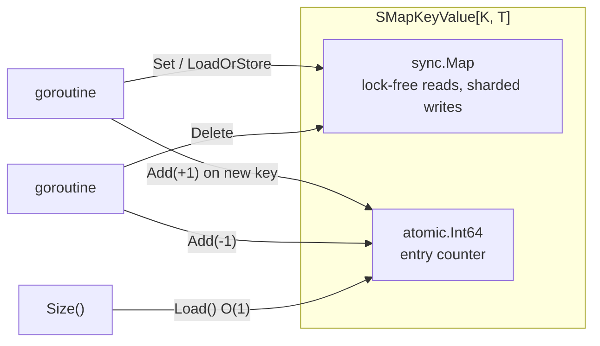
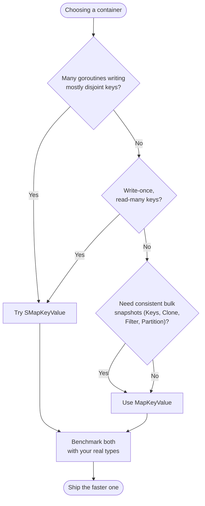

# 🧱 Containers

r9e provides two containers with the **same method set** but different internal
machinery. This guide explains how each is built and how to choose.

## 🔬 `MapKeyValue` internals

`MapKeyValue` wraps a native Go `map` behind a `sync.RWMutex`. Many readers can
hold the read lock at once; a writer takes the lock exclusively. `Size()` is a
plain `len()` of the map under the read lock.



Because reads and writes are serialized through one mutex, bulk operations
(`Keys`, `Values`, `Clone`, `Map`, `Filter`, `Partition`, `All`) observe a
**consistent snapshot** of the map — no entry is half-updated mid-scan.

## 🔬 `SMapKeyValue` internals

`SMapKeyValue` wraps a `sync.Map` alongside an `atomic.Int64` entry counter.
`sync.Map` keeps its own internal read/dirty structures and never needs an
external lock. The atomic counter is adjusted on every insert/delete so that
`Size()` is **O(1)** instead of requiring a full `Range`.



The counter is kept accurate across overwrites: `Set` uses `Swap` and only
increments when the key was **not** already present, so overwriting an existing
key does not inflate `Size()`.

## 📊 Comparison

| Aspect | `MapKeyValue` | `SMapKeyValue` |
| ------ | ------------- | -------------- |
| Backing store | native `map` + `sync.RWMutex` | `sync.Map` + `atomic.Int64` |
| Constructor | `NewMapKeyValue[K, T](opts...)` | `NewSMapKeyValue[K, T]()` |
| Presizing | `WithCapacity(n)` | not available |
| `Size()` cost | O(1) (`len` under RLock) | O(1) (atomic load) |
| Concurrent reads | shared read lock | lock-free |
| Concurrent writes | serialized by exclusive lock | sharded, low contention on disjoint keys |
| Bulk snapshot consistency | strong (lock held during scan) | moment-in-time (`sync.Map.Range`) |
| Iteration + mutation | ❌ deadlocks (lock held) | ⚠️ allowed, but reflects a live view |
| Best for | read-heavy / mixed; consistent bulk ops | disjoint-key writes; write-once/read-many |

## 🧭 Which container should I use?



**Default to `MapKeyValue`.** `sync.Map` is optimized for two specific access
patterns — write-once/read-many, and many goroutines updating disjoint key
sets. Outside those patterns a plain mutex-guarded map is usually simpler and
faster. Whichever you lean toward, [benchmark both](performance.md) with your
own key and value types before committing.

## 🔀 Switching between them

Since the method sets are identical, swapping is a one-line change:

```go
// Before
kv := r9e.NewMapKeyValue[string, int]()

// After — every call site below still compiles unchanged
kv := r9e.NewSMapKeyValue[string, int]()
```

If you want to keep call sites backend-agnostic, program against a small local
interface that lists the methods you actually use, and accept either concrete
type.

## ➡️ Next

- Understand locking and the iteration rules in [Concurrency](concurrency.md).
- Explore the shared method set in [Operations](operations.md).
