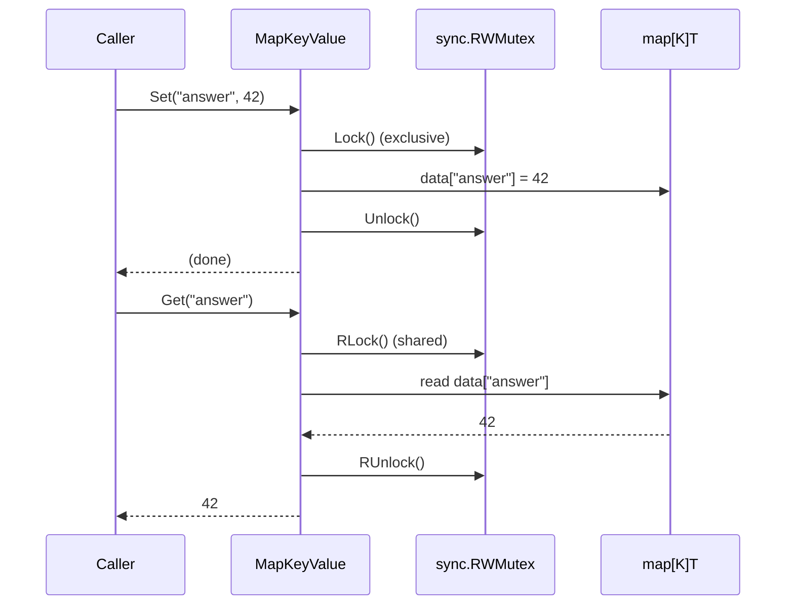

# 🚀 Getting Started

## 📦 Installation

```bash
go get github.com/slashdevops/r9e
```

Update to the latest available version:

```bash
go get -u github.com/slashdevops/r9e
```

`r9e` requires **Go 1.26 or newer** and has **zero third-party dependencies** —
only the Go standard library.

## 👋 Your First Program

```go
package main

import (
    "fmt"

    "github.com/slashdevops/r9e"
)

func main() {
    kv := r9e.NewMapKeyValue[string, int]()

    kv.Set("answer", 42)

    if v, ok := kv.GetAndCheck("answer"); ok {
        fmt.Println(v) // 42
    }

    for k, v := range kv.All() {
        fmt.Printf("%s=%d\n", k, v)
    }
}
```

`NewMapKeyValue[string, int]()` constructs a container whose keys are `string`
and whose values are `int`. Everything is type-checked at compile time — there
are no `interface{}`/`any` casts in your code and no runtime type assertions.

## 🧱 Core Types

r9e exposes two containers with an **identical method set**:

| Type | Backed by | Constructor |
| ---- | --------- | ----------- |
| `MapKeyValue[K comparable, T any]` | native Go `map` + `sync.RWMutex` | `r9e.NewMapKeyValue[K, T](opts...)` |
| `SMapKeyValue[K comparable, T any]` | `sync.Map` + atomic size counter | `r9e.NewSMapKeyValue[K, T]()` |

Because the API is the same, you can prototype against `MapKeyValue` and switch
to `SMapKeyValue` later without touching your call sites. See
[Containers](containers.md) for how to choose.

### The type parameters

- **`K comparable`** — the key type. Any comparable type works: `string`,
  every integer/float kind, `bool`, pointers, and comparable structs/arrays.
- **`T any`** — the value type. Any type at all, including structs, slices,
  maps, pointers, and interfaces.

```go
users   := r9e.NewMapKeyValue[int, User]()          // int keys, struct values
config  := r9e.NewMapKeyValue[string, string]()      // string → string
tallies := r9e.NewSMapKeyValue[string, int]()        // sync.Map-backed counter
```

## 🔁 A Set → Get Round Trip

The following sequence shows what happens inside a `MapKeyValue` on a `Set`
followed by a `Get`. Writes take the exclusive lock; reads take a shared read
lock (covered in depth in [Concurrency](concurrency.md)).



## 🎛️ Presizing with `WithCapacity`

When you know roughly how many entries you will store, presize the underlying
map at construction time to avoid incremental reallocation as it grows. This is
a `MapKeyValue`-only option.

```go
// Presize for ~10,000 entries.
kv := r9e.NewMapKeyValue[string, int](r9e.WithCapacity(10_000))

for i := range 10_000 {
    kv.Set(fmt.Sprintf("key-%d", i), i)
}
```

`WithCapacity` is a **performance hint** only — it changes nothing about
behavior or semantics, and the container still grows on demand if you exceed
the hint. `SMapKeyValue` takes no options; `sync.Map` manages its own storage.

## 🧪 Distinguishing "absent" from "zero"

`Get` returns the zero value of `T` when a key is absent, which is
indistinguishable from a stored zero. Use `GetAndCheck` when you need to know
whether the key existed:

```go
v := kv.Get("missing")            // 0 — but was it stored as 0, or absent?
v, ok := kv.GetAndCheck("missing") // ok == false means truly absent
```

## ➡️ Next

- Learn the difference between the two backends in [Containers](containers.md).
- Understand the locking model in [Concurrency](concurrency.md).
