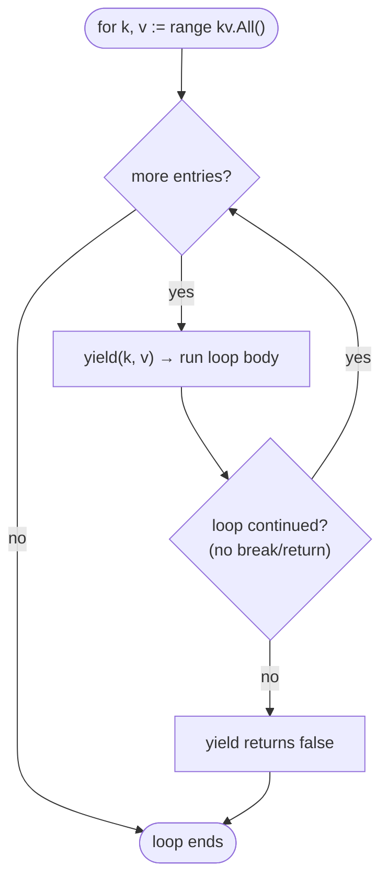

# 🔁 Iteration

There are three ways to walk a container: the modern `All()` range-over-func
iterator, the `ForEach*` callbacks, and materialized `Keys()`/`Values()`
slices. All of them produce entries in **unspecified order**.

## ✨ `All()` — range-over-func (preferred)

`All()` returns an `iter.Seq2[K, T]`, so you can range over it directly with
the Go 1.23+ range-over-func feature:

```go
for k, v := range kv.All() {
    fmt.Printf("%s = %d\n", k, v)
}
```

Break early to stop; the iterator stops yielding as soon as the loop exits.

```go
for k, v := range kv.All() {
    if v > threshold {
        fmt.Println("found", k)
        break // stops iteration cleanly
    }
}
```

### How the yield loop works

A range-over-func iterator is a function that calls `yield(k, v)` for each pair.
Ranging over it drives that function; returning `false` from `yield` (which the
`for` loop does on `break`/`return`) tells it to stop.



> ⛔ **`MapKeyValue` only:** the read lock is held for the entire loop, so the
> body must not mutate the same container. See the deadlock rule in
> [Concurrency](concurrency.md). `SMapKeyValue` iteration reflects a
> moment-in-time view and does not lock across the body.

## 📞 The `ForEach` family

Older callback-style iteration. Prefer `All()` in new code, but these remain
useful when you already have a function to apply.

```go
kv.ForEach(func(k string, v int) {
    fmt.Printf("%s=%d\n", k, v)
})

kv.ForEachKey(func(k string) {   /* keys only  */ })
kv.ForEachValue(func(v int) {    /* values only */ })
```

The same "don't mutate during iteration" rule applies to `MapKeyValue`.

## 📦 `Keys()` and `Values()` — materialized snapshots

When you want a slice you fully own (safe to mutate, sort, or pass around) and
you do not need to iterate lazily:

```go
keys := kv.Keys()     // []K, unordered snapshot
values := kv.Values() // []T, unordered snapshot
```

These allocate a new slice each call. Because they return a snapshot rather than
holding a lock, you can freely mutate the container afterward.

## 🔢 Deterministic iteration

Map order is randomized in Go, so none of the above is stable across runs. For
reproducible output, sort first with `SortKeys` and look values up as you go:

```go
kv := r9e.NewMapKeyValue[string, int]()
kv.Set("c", 3); kv.Set("a", 1); kv.Set("b", 2)

for _, k := range kv.SortKeys(func(a, b string) bool { return a < b }) {
    fmt.Printf("%s=%d\n", k, kv.Get(k))
}
// a=1
// b=2
// c=3
```

This pattern reads from the container inside the loop, which is a **read**, so
it is safe on both containers — no mutation occurs.

## 🧭 Choosing an iteration style

| Need | Use |
| ---- | --- |
| Idiomatic loop, lazy, early break | `All()` |
| Apply an existing callback | `ForEach` / `ForEachKey` / `ForEachValue` |
| A slice you own to sort or pass on | `Keys()` / `Values()` |
| Stable, reproducible order | `SortKeys` / `SortValues` |

## ➡️ Next

- Serialize the collection with [JSON](json.md).
- Understand the cost of each walk in [Performance](performance.md).
