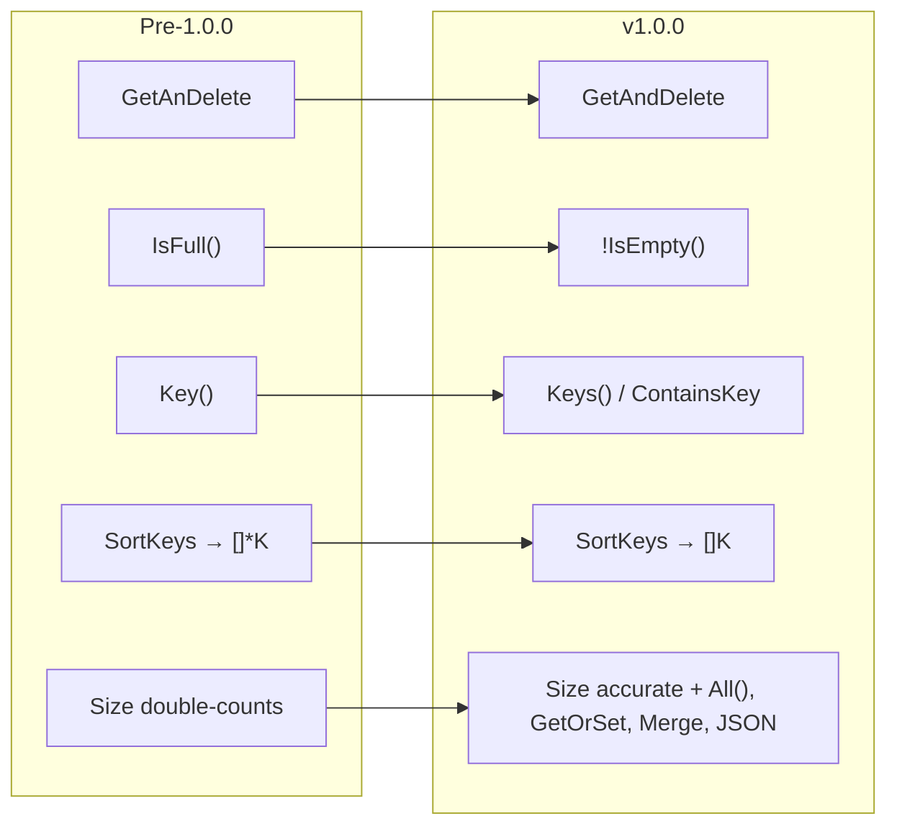

# 🚦 Migration

This guide covers what changed in **v1.0.0** and how to move existing code onto
it. v1.0.0 is a cleanup-and-modernize release: the API is smaller, more
consistent, and built on newer standard-library facilities.

## ✨ What's new in v1.0.0

- **Range-over-func iteration** — `All()` returns an `iter.Seq2[K, T]` so you
  can write `for k, v := range kv.All() { ... }`. See [Iteration](iteration.md).
- **`GetOrSet`** — atomic get-or-insert on both containers.
- **`Merge`** — copy entries from another container, overwriting, with
  nil/self-merge treated as a safe no-op.
- **JSON support** — `MarshalJSON`/`UnmarshalJSON` on both containers; use a
  container directly as a struct field. See [JSON](json.md).
- **Deadlock fixes in the `MapKeyValue` (RWMutex) container** — cross-container
  operations (`Merge`, `DeepEqual`, `CloneAndClear`) now take a snapshot instead
  of locking two containers at once, removing lock-ordering deadlocks.
- **Modern stdlib internals** — `maps` (Copy), `slices` (SortFunc), the builtin
  `clear`, and `sync.Map.Clear` power the implementation.
- **Accurate `SMapKeyValue.Size()`** — an atomic counter keeps `Size()` O(1)
  and correct across overwrites.

## 💥 Breaking changes

| Change | Before | After |
| ------ | ------ | ----- |
| **Go version** | Go 1.19 | **Go 1.26+** required |
| **Typo fixed** | `GetAnDelete` | `GetAndDelete` |
| **Removed `IsFull()`** | `kv.IsFull()` | use `!kv.IsEmpty()` |
| **Removed `Key()`** | `kv.Key()` | removed — use `Keys()` / `ContainsKey` |
| **`SortKeys` return type** | `[]*K` | `[]K` |
| **`SortValues` return type** | `[]*T` | `[]T` |
| **`SMapKeyValue.Size()`** | double-counted overwrites | accurate on overwrite |

### 1. Requires Go 1.26+

Update your toolchain and `go.mod`:

```go
// go.mod
go 1.26.0
```

The library uses generics, range-over-func iterators (`iter.Seq2`),
`sync.Map.Clear`, and the `maps`/`slices` packages, which require a recent
toolchain.

### 2. `GetAnDelete` → `GetAndDelete`

A spelling fix. Update call sites:

```go
// Before
v, ok := kv.GetAnDelete("token")

// After
v, ok := kv.GetAndDelete("token")
```

### 3. `IsFull()` removed

There was never a capacity ceiling to be "full" against. Invert the emptiness
check instead:

```go
// Before
if kv.IsFull() { ... }

// After
if !kv.IsEmpty() { ... }
```

### 4. `Key()` removed

Use `Keys()` for the full snapshot, or `ContainsKey` to test membership:

```go
// Before
ks := kv.Key()

// After
ks := kv.Keys()               // []K snapshot
present := kv.ContainsKey("a") // membership test
```

### 5. `SortKeys` / `SortValues` return values, not pointers

They now return `[]K` / `[]T` directly — no more dereferencing.

```go
// Before
for _, kp := range kv.SortKeys(less) {
    fmt.Println(*kp)
}

// After
for _, k := range kv.SortKeys(func(a, b string) bool { return a < b }) {
    fmt.Println(k)
}
```

### 6. `SMapKeyValue.Size()` is now accurate on overwrite

Previously, re-setting an existing key inflated the reported size. Now `Set`
only increments the counter for genuinely new keys.

```go
sm := r9e.NewSMapKeyValue[string, int]()
sm.Set("a", 1)
sm.Set("a", 2) // overwrite
sm.Set("b", 3)
fmt.Println(sm.Size()) // 2  (was 3 in older versions)
```

If any code compensated for the old double-counting bug, remove that
workaround.

## 🔁 Before / after at a glance



## ✅ Migration checklist

1. Bump the toolchain to **Go 1.26+** and update `go.mod`.
2. Rename `GetAnDelete` → `GetAndDelete`.
3. Replace `IsFull()` with `!IsEmpty()`.
4. Replace `Key()` with `Keys()` or `ContainsKey`.
5. Drop pointer dereferences on `SortKeys`/`SortValues` results.
6. Remove any workaround for the old `SMapKeyValue.Size()` overcount.
7. `go build ./...` and `go test ./...` to confirm the tree is clean.

## ➡️ Next

- Adopt the new iterators in [Iteration](iteration.md).
- Try `GetOrSet` and `Merge` in [Operations](operations.md).
