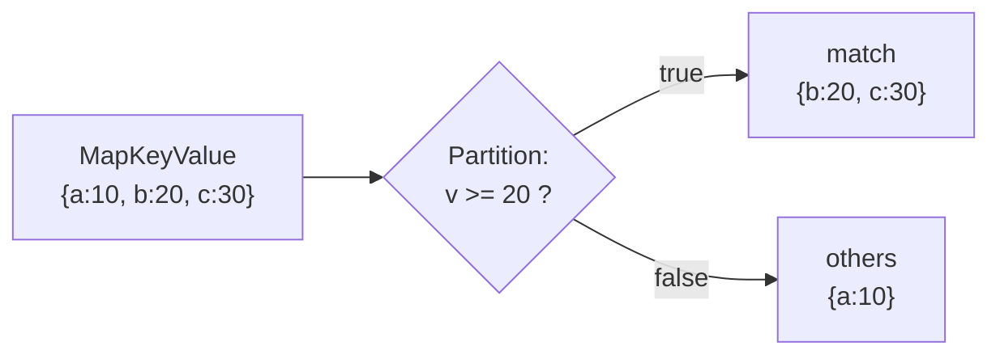

# 🧰 Operations

Beyond `Set`/`Get`, both containers share a set of functional helpers. A key
property runs through all of them:

> **Non-mutating helpers return new, independent containers.** `Map`, `MapKey`,
> `MapValue`, `Filter`, `FilterKey`, `FilterValue`, `Partition`,
> `PartitionKey`, `PartitionValue`, `Clone`, and `CloneAndClear` never modify
> the receiver.

## 🔎 Reads and existence

```go
kv := r9e.NewMapKeyValue[string, int]()
kv.Set("a", 1)

v := kv.Get("a")                 // 1 (zero value if absent)
v, ok := kv.GetAndCheck("a")     // 1, true
has := kv.ContainsKey("a")       // true
hasV := kv.ContainsValue(1)      // true — O(n), uses reflect.DeepEqual
n := kv.Size()                   // 1
empty := kv.IsEmpty()            // false
```

## ➕ `GetOrSet` — atomic get-or-insert

Returns the existing value if the key is present, otherwise stores and returns
the new one. The check-and-store happens atomically under a single lock, so it
is race-free even when many goroutines call it at once.

```go
v, loaded := kv.GetOrSet("hits", 1)
// first call:  v == 1,  loaded == false (stored)
// later call:  v == 1,  loaded == true  (existing value returned, arg ignored)
```

## 🗑️ `GetAndDelete` — remove and return

```go
value, loaded := kv.GetAndDelete("token")
// loaded reports whether the key was present; the entry is now gone
```

## 🧬 `Merge` — copy entries in

Copies every entry from `other` into the receiver, **overwriting** keys that
already exist. `other` is read via a consistent snapshot, so the two containers
are never locked at the same time. A `nil` `other`, or merging a container into
itself, is a safe no-op.

```go
a := r9e.NewMapKeyValue[string, int]()
a.Set("x", 1); a.Set("y", 2)

b := r9e.NewMapKeyValue[string, int]()
b.Set("y", 20); b.Set("z", 30)

a.Merge(b) // a is now {x:1, y:20, z:30} — b is unchanged
```

## 🪞 `Clone` and `CloneAndClear`

```go
snapshot := kv.Clone()        // new independent copy; kv unchanged
drained  := kv.CloneAndClear() // copy returned, receiver left empty (atomically for MapKeyValue)
```

`CloneAndClear` on `MapKeyValue` copies and clears under a single exclusive
lock. On `SMapKeyValue` the copy and clear are two steps — see the doc comment
if concurrent writers may race the transition.

## 🔧 `Map`, `MapKey`, `MapValue` — transform

Each returns a new container; the receiver is untouched.

```go
kv := r9e.NewMapKeyValue[string, int]()
kv.Set("a", 1); kv.Set("b", 2)

doubled := kv.MapValue(func(v int) int { return v * 2 })      // {a:2, b:4}
upper   := kv.MapKey(func(k string) string { return strings.ToUpper(k) }) // {A:1, B:2}
both    := kv.Map(func(k string, v int) (string, int) {       // {a!:10, b!:20}
    return k + "!", v * 10
})
```

> ⚠️ With `Map`/`MapKey`, if your function produces the same key for two inputs,
> the later write wins and the result has fewer entries — exactly like assigning
> to a Go map.

## 🧹 `Filter`, `FilterKey`, `FilterValue` — select

Keep only the pairs for which the predicate returns `true`.

```go
kv := r9e.NewMapKeyValue[string, int]()
kv.Set("one", 1); kv.Set("two", 2); kv.Set("three", 3); kv.Set("four", 4)

even := kv.FilterValue(func(v int) bool { return v%2 == 0 }) // {two:2, four:4}
long := kv.FilterKey(func(k string) bool { return len(k) > 3 }) // {three:3, four:4}
```

## ✂️ `Partition`, `PartitionKey`, `PartitionValue` — split in two

Returns **two** new containers: `match` (predicate true) and `others` (the
rest). Every entry lands in exactly one of them.



```go
kv := r9e.NewMapKeyValue[string, int]()
kv.Set("a", 10); kv.Set("b", 20); kv.Set("c", 30)

big, small := kv.Partition(func(_ string, v int) bool { return v >= 20 })
// big:   {b:20, c:30}
// small: {a:10}
```

## 🔀 `SortKeys` and `SortValues` — ordered slices

Because the containers are unordered, sorting produces a **slice** (not a new
container) ordered by a `less` function. `SortKeys` returns `[]K`;
`SortValues` returns `[]T`.

```go
kv := r9e.NewMapKeyValue[string, float64]()
kv.Set("pi", 3.14); kv.Set("e", 2.71); kv.Set("phi", 1.61)

keys := kv.SortKeys(func(a, b string) bool { return a < b })   // [e phi pi]
vals := kv.SortValues(func(a, b float64) bool { return a < b }) // [1.61 2.71 3.14]
```

## 🟰 `DeepEqual` — structural comparison

Reports whether two containers hold the same keys mapped to deeply equal values
(`reflect.DeepEqual`). The two containers are never locked simultaneously.

```go
same := kv.DeepEqual(other) // true only if keys and values all match
```

## 📋 Cheat sheet

| Method | Mutates receiver? | Returns |
| ------ | ----------------- | ------- |
| `Set`, `Delete`, `Clear`, `Merge` | ✅ yes | — |
| `GetOrSet`, `GetAndDelete` | ✅ yes | value (+ bool) |
| `CloneAndClear` | ✅ clears | new container |
| `Get`, `GetAndCheck`, `ContainsKey/Value`, `Size`, `IsEmpty` | ❌ no | value / bool / int |
| `Clone`, `Map*`, `Filter*`, `Partition*` | ❌ no | new container(s) |
| `Keys`, `Values`, `SortKeys`, `SortValues` | ❌ no | new slice |
| `DeepEqual` | ❌ no | bool |

## ➡️ Next

- Walk the collection with [Iteration](iteration.md).
- Serialize it with [JSON](json.md).
