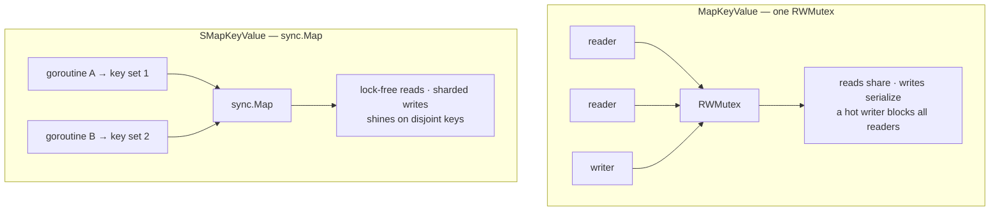

# ⚡ Performance

r9e is a thin, allocation-conscious layer over the standard library's own map
and `sync.Map`. Its cost is dominated by those primitives plus the
synchronization needed to make them safe. This guide covers the cost model, how
to keep it low, and how to measure.

## 🧮 Cost model

| Operation | Cost |
| --------- | ---- |
| `Set`, `Get`, `GetAndCheck`, `GetOrSet`, `Delete`, `GetAndDelete`, `ContainsKey` | **O(1)** |
| `Size`, `IsEmpty` | **O(1)** (`len` under RLock, or an atomic load) |
| `Clear` | O(1)–O(n) depending on the runtime |
| `ContainsValue` | **O(n)** — scans values with `reflect.DeepEqual` |
| `Keys`, `Values`, `All`, `ForEach*`, `Clone`, `Merge`, `DeepEqual` | **O(n)** |
| `Map*`, `Filter*`, `Partition*` | **O(n)** + allocates a new container |
| `SortKeys`, `SortValues` | **O(n log n)** |
| `MarshalJSON`, `UnmarshalJSON` | **O(n)** |

The single-key operations are constant time. Everything that touches every
entry is linear and allocates a fresh slice or container.

## 🔐 Where the time goes

The overhead on top of the raw map is synchronization. The two backends trade
off differently under contention:



- **`MapKeyValue`** is excellent for read-heavy and mixed workloads, and gives
  strong snapshot consistency for bulk ops. A single frequently-writing
  goroutine can become a bottleneck because writes are serialized.
- **`SMapKeyValue`** avoids that serialization when goroutines touch disjoint
  keys or when keys are written once and read many times — the patterns
  `sync.Map` is built for. Outside those, its bookkeeping overhead can make it
  slower than a plain mutexed map.

## 📏 Presizing with `WithCapacity`

If you know the approximate final size of a `MapKeyValue`, presize it once to
avoid repeated rehashing as it grows:

```go
kv := r9e.NewMapKeyValue[string, int](r9e.WithCapacity(100_000))
```

This is a hint, not a hard cap — the map still grows past it if needed. It has
no effect on `SMapKeyValue`, which manages its own storage.

## 💡 Tuning levers

| Lever | Effect |
| ----- | ------ |
| Presize with `WithCapacity` | Avoids incremental map growth for `MapKeyValue`. |
| Prefer O(1) lookups over `ContainsValue` | Key an index instead of scanning values. |
| Reuse a container; call `Clear` | Retains capacity, avoids re-allocating. |
| Batch reads, minimize write frequency | Fewer exclusive-lock acquisitions on `MapKeyValue`. |
| Choose the backend that fits the access pattern | See [Containers](containers.md). |
| Avoid bulk ops in hot paths | `Keys`/`Values`/`Clone`/`Map`/`Filter` all allocate O(n). |

## 🏁 Benchmarks

The test suite includes benchmarks for both containers. Run them with:

```bash
go test -run '^$' -bench . ./...
```

Add memory allocation stats:

```bash
go test -run '^$' -bench . -benchmem ./...
```

The `-run '^$'` selects no unit tests, so only benchmarks execute. Benchmarks
use the Go 1.24+ `for b.Loop()` form, which excludes per-benchmark setup from
the timed region automatically:

```go
func BenchmarkSet(b *testing.B) {
    kv := r9e.NewMapKeyValue[int, int]()
    for b.Loop() {
        kv.Set(1, 1)
    }
}
```

## 🧭 Practical guidance

1. **Default to `MapKeyValue`.** Switch to `SMapKeyValue` only when its access
   pattern (disjoint-key writes, or write-once/read-many) fits.
2. **Benchmark both** with your real key and value types before committing —
   micro-benchmark intuition rarely survives contact with a real workload.
3. **Presize** with `WithCapacity` when the size is known.
4. **Index, don't scan.** Replace `ContainsValue` (O(n)) with a secondary
   container keyed by the value you look up.
5. **Keep bulk operations out of hot loops** — they allocate O(n) each call.

## ➡️ Next

- Understand the backend trade-offs in [Containers](containers.md).
- Common questions and gotchas: [FAQ](faq.md).
